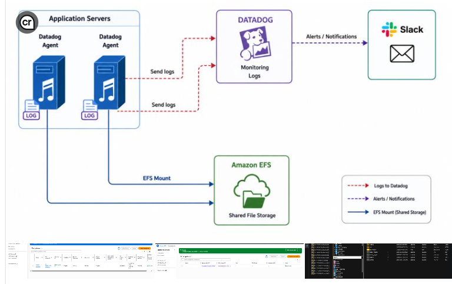

# AWS Monitoring and Shared Storage Infrastructure Project

## Project Overview

This project involved designing and implementing a centralized monitoring and storage solution for AWS application servers.

## Architecture Diagram

## Architecture Diagram

The architecture consists of two application servers running Datadog agents. Logs are forwarded to Datadog for monitoring and analysis. Slack is integrated for alert notifications, while Amazon EFS provides shared storage accessible from multiple application servers.

## Technologies Used

- AWS EC2
- Amazon EFS
- Datadog
- Slack
- Linux

## Skills Demonstrated

- Cloud Infrastructure
- AWS Administration
- Monitoring and Observability
- Incident Response
- Log Management
- Technical Troubleshooting
